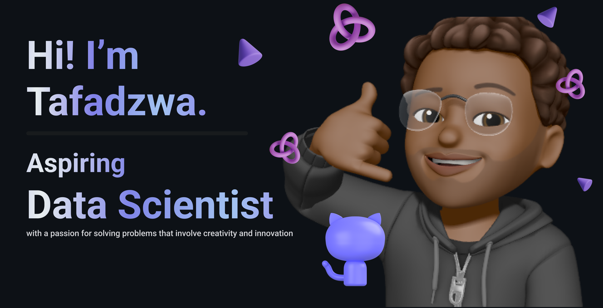

  
  
  # 👨‍💻 Tafadzwa Chigumira
  
  
  
  

  > _"Building tomorrow's technology, one line of code at a time."_

## 🎓 About Me

I'm a passionate third-year Computer Engineering student with a keen interest in pushing the boundaries of technology. My journey in tech is driven by curiosity and the desire to create impactful solutions that make a difference.

### 🚀 What I Do

- 💡 Exploring cutting-edge technologies in ML/AI
- 🌐 Developing robust web applications
- 🔧 Building scalable software solutions
- 📊 Working with data and analytics

## 🛠️ Technical Arsenal

### Programming Languages

### Frameworks & Libraries

### API Development

### AI/ML Stack

### Cloud & DevOps

### Tools

### Databases

## 🤝 Let's Connect!

I'm always excited to collaborate on interesting projects or discuss technology. Feel free to connect with me on [LinkedIn](https://www.linkedin.com/in/tafadzwa-chigumira).

  <i>⭐️ From [Tafadzwa-Chigumira](https://github.com/Tafadzwa-Chigumira)</i>

